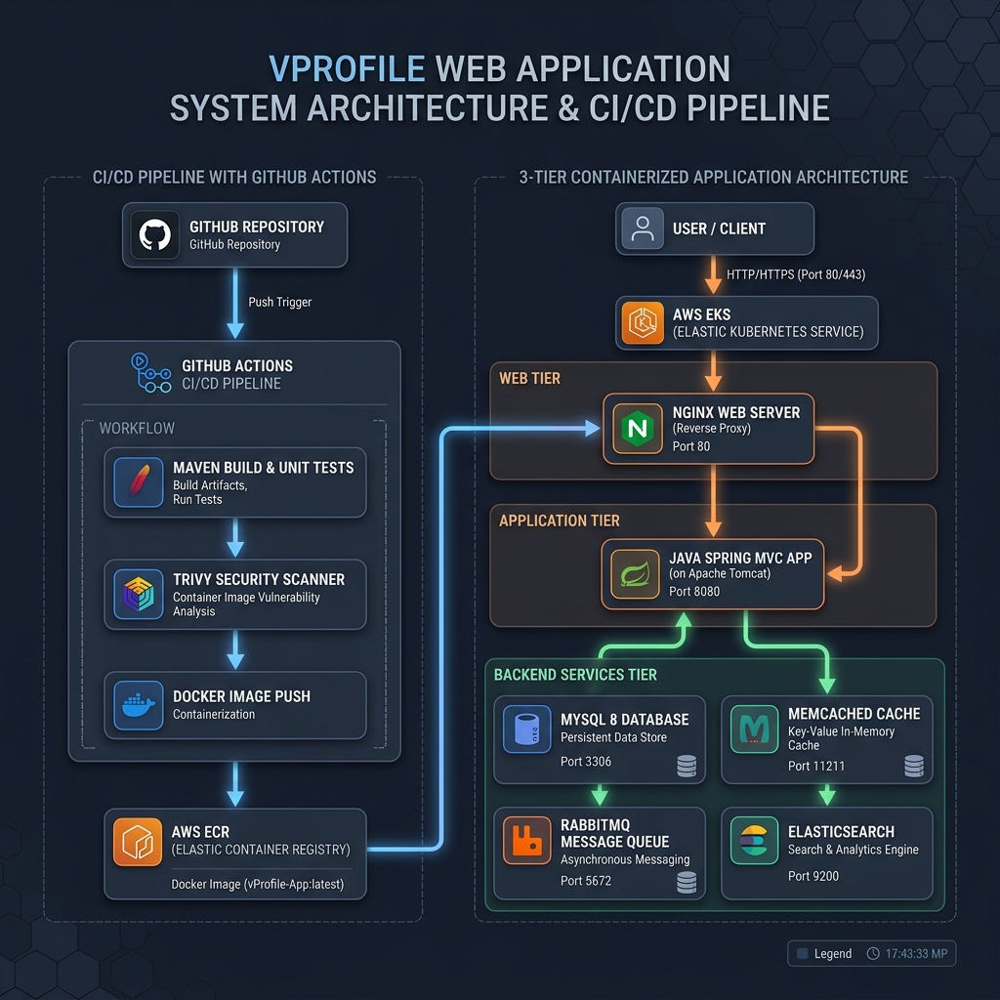
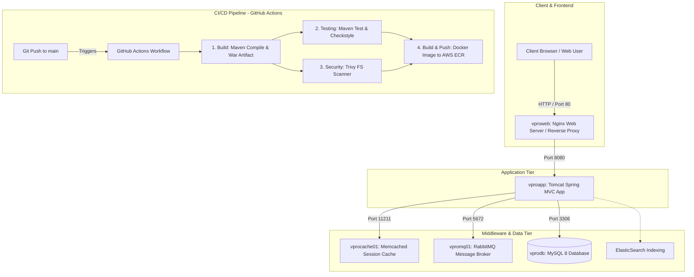

# Project Architecture & System Overview

This repository contains **vprofile-project**, a multi-tier enterprise web application built with Java Spring MVC and containerized microservice infrastructure, along with an automated GitHub Actions CI/CD deployment pipeline to AWS ECR.

---

## 🎨 System Architecture Diagram

---

## 🏗 System Architecture Overview

---

## 🧩 Component & Service Breakdown

### 1. Web Layer (`vproweb`)
* **Technology**: Nginx Reverse Proxy
* **Port**: `80`
* **Role**: Acts as the ingress load balancer and web server, routing external user traffic to the backend Java application container.

### 2. Application Layer (`vproapp`)
* **Technology**: Java Spring MVC, Spring Security, Spring Data JPA running on Apache Tomcat
* **Port**: `8080`
* **Artifact**: `vprofile.war` compiled via Maven (`pom.xml`)
* **Role**: Handles core business logic, user authentication, session state management, database transactions, and message publishing.

### 3. Middleware & Storage Services
* **Database (`vprodb`)**: MySQL 8 (Port `3306`) holding relational account data imported from `db_backup.sql`.
* **Cache (`vprocache01`)**: Memcached (Port `11211`) for fast user session storage and query caching.
* **Message Queue (`vpromq01`)**: RabbitMQ (Port `5672`) for asynchronous queue processing and job execution.
* **Search Engine**: ElasticSearch integration for search indexing capabilities.

---

## 🔄 CI/CD Pipeline Architecture (GitHub Actions & AWS)

The automated workflow defined in `.github/workflows/main.yml` executes on every push to the `main` branch:

1. **Build Job**:
   - Checks out repository (`actions/checkout@v7`).
   - Compiles application using Maven (`mvn install`).
   - Archives the generated web application package (`vprofile.war`).
2. **Testing Job**:
   - Executes automated unit tests (`mvn test`).
   - Runs code quality checks (`mvn checkstyle:checkstyle`).
3. **Security Scan Job**:
   - Performs static security vulnerability analysis across filesystem and dependencies using **Trivy** (`aquasecurity/trivy-action`).
   - Generates and uploads security report (`trivy-report.json`).
4. **Containerization & Deployment Job**:
   - Authenticates with **AWS** via `aws-actions/configure-aws-credentials`.
   - Logs into **Amazon Elastic Container Registry (ECR)**.
   - Builds production multi-stage Docker image using `Docker-files/app/multistage/Dockerfile`.
   - Tags the image with `$github.sha` and pushes it to AWS ECR.

---

## 🛠 Provisioning & Execution Options

* **Docker Compose**: Instant multi-container stack deployment (`docker-compose.yml`).
* **Vagrant**: Local multi-VM sandbox setup (`vagrant/`).
* **Ansible**: Automated server provisioning and configuration playbooks (`ansible/`).
